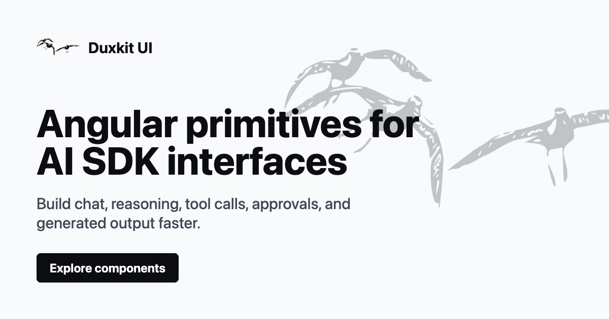

# DuxKit

[](https://github.com/duxkit/duxkit/actions/workflows/ci.yml)
[](https://www.npmjs.com/package/@duxkit/ui)
[](LICENSE)



Editable Angular primitives for building chat, agent, tool-call, reasoning, approval, and
generated-output interfaces with the AI SDK.

DuxKit is UI infrastructure rather than a chat application, backend framework, or provider SDK.
The published [`@duxkit/ui`](https://www.npmjs.com/package/@duxkit/ui) CLI installs selected
primitive source directly into Angular CLI and Nx applications, so the generated code belongs to
the consuming project and can be changed without wrapping a component package.

Documentation and examples are available at [duxkit.com](https://duxkit.com). See the
[changelog](https://duxkit.com/docs/changelog) for the main changes in each release bundle.

## Get started

Initialize DuxKit in an Angular workspace:

```bash
pnpm dlx @duxkit/ui@latest init
```

Then choose primitives interactively or name them directly:

```bash
pnpm dlx @duxkit/ui@latest add
pnpm dlx @duxkit/ui@latest add conversation message prompt-input
```

`init` detects the Angular application, configures Tailwind CSS v4 and the Spartan preset, installs
baseline dependencies, and records the generated-source location in `duxkit-ai.json`.

`add` resolves primitive dependencies, installs only the packages required by the selection, and
writes editable Angular source into the configured library. Use `--dry-run` to inspect either plan
without changing the workspace:

```bash
pnpm dlx @duxkit/ui@latest init --dry-run
pnpm dlx @duxkit/ui@latest add message --dry-run
```

See the [CLI README](projects/cli/README.md) for configuration, safety guarantees, and all command
options.

## How it works

- [`projects/duxkit-ai`](projects/duxkit-ai/README.md) is the canonical internal source for the
  primitive families. It is not published to npm or installed by consumers.
- [`@duxkit/ui`](projects/cli/README.md) is the published CLI. Its packaged templates are derived
  from the canonical primitive source.
- Consumer applications own the generated files and import them from their configured local
  library.

This model keeps the reusable source and documentation consistent while leaving application code
fully editable.

## Compatibility

The current primitive source targets:

| Dependency        | Supported range    |
| ----------------- | ------------------ |
| Angular           | `^22.0.4`          |
| Angular CDK       | `>=22.0.2 <23.0.0` |
| `@ai-sdk/angular` | `^2.0.208`         |
| AI SDK (`ai`)     | `^6.0.207`         |
| Tailwind CSS      | `>=4.0.0`          |
| Spartan Brain     | `^1.0.2`           |

The CLI supports the Node.js ranges declared by its
[`engines`](projects/cli/package.json) field. Repository development uses the Node.js version in
[`.nvmrc`](.nvmrc) and the pnpm version pinned in [`package.json`](package.json).

## Primitive families

```text
attachment
chain-of-thought
checkpoint
code-block
confirmation
context
conversation
markdown
message
model-selector
prompt-input
queue
reasoning
reasoning-effort
shimmer
sources
task
tool
```

Run `pnpm dlx @duxkit/ui@latest list` for the current registry, aliases, installed primitives, and
dependency groups.

## Repository

```text
projects/
  cli/         published @duxkit/ui source installer
  duxkit-ai/   canonical primitive source and workspace library
  ui/          private Helm primitives used by workspace applications
  www/         documentation site
```

Set up the workspace with the pinned toolchain:

```bash
nvm use
pnpm install
```

Common commands:

```bash
pnpm start
pnpm test:ci
pnpm build
pnpm build:storybook
pnpm docs:generate-metadata
```

Library output is written to `dist/duxkit-ai`, CLI output to `dist/cli`, and the documentation site
to `dist/www`.

## Contributing

Read [CONTRIBUTING.md](CONTRIBUTING.md) before opening a pull request. When component APIs change,
regenerate the checked-in docs metadata:

```bash
pnpm docs:generate-metadata
```

Run the release-level checks before submitting:

```bash
pnpm check:conventions
pnpm cli:check-templates
pnpm test:ci
pnpm build
pnpm check:package-entrypoints
pnpm smoke:cli
pnpm build:storybook
```

Follow the [changelog workflow](docs/agent-skills/add-changelog-entry/SKILL.md) to select the
release bundle before adding entries to the [changelog](projects/www/src/app/routes/docs/data/changelog.ts).
New releases get a new bundle; preserve previous releases. Group entries under WWW, CLI, or UI,
and do not backfill changes from before v0.4.

## Stability

`@duxkit/ui` and the generated primitive APIs are pre-1.0. Breaking changes may happen before a
stable release and will be documented in the changelog where practical.

## Security and conduct

Report vulnerabilities through the process in [SECURITY.md](SECURITY.md), not through a public
issue. Provider credentials belong on an application server or API route, never in generated
browser code.

Participation is governed by the [Code of Conduct](CODE_OF_CONDUCT.md).

## License

[MIT](LICENSE)
